# El proceso de visualización

### Entradas

- Modelo de escena: estructura de datos en memoria que almacena lo que se quiere ver.
  - Modelo geométrico: primitivas (polígonos planos) que definen la forma de los objetos a visualizar.
  - Modo de aspecto: parámetros que definen material, color, texturas, fuentes de luz

- Parámetros de visualización: conjunto amplio de valores que determinan como se visualiza la escena en imagen.
  - Cámara virtual: posición, orientación y ángulo.
  - Viewport: resolución de la imagen y posiciónde la misma en la ventana.

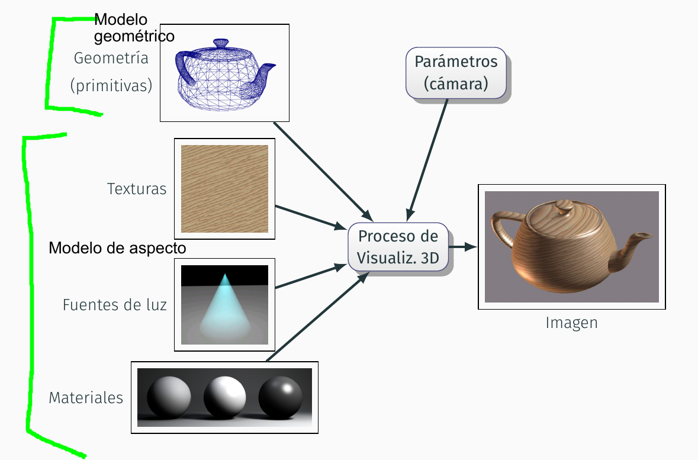


## Rasterización y ray-tracing

Procesos para asignar a cada pixel su color correspondiente.

### Rasterización

Calcular, para cada primitiva, qué pìxels tienen su centro cubierto por ella.

1. Inicializar el color de todos los pixels
2. Para cada primitiva P:
  - Encontrar los pixeles cubiertos por P
  - Para cada pixel q:
    - Calcular el color de P en q
    - Actualizar el color de q

- La complejidad es _O(n·p)_
- Las GPUs están diseñadas para rasterización eficiente (actualmente también hay gpus para ray-tracing)
- Es el método que se usa en aplicaciones interactivas, videojuegos, realidad virtual y simulación.


### Ray-tracing

1. Inicializar el color de todos los pixels
2. Para cada pixel q de la imagen:
  - Calcular el conjunto de primitivas que cubren q
  - Para cada primitiva P:
    - Calcular el color de P en q
    - Actualizar el color de q

- Este método es más lento pero consigue resultados más realistas para ciertos tipos de efectos visuales.
- Es el que se usa en animaciones y efectos especiales.
- Algunos videojuegos están empezando a usar ray-tracing.

## Cauce gráfico (rasterización)

 El cauce gráfica es el conjunto de etapas para "producir" una imagen por rasterización. Las entradas al cauce gráfico se denominan primitivas, que pueden ser: triángulos, segmentos o puntos. Las primitivas se especifican mediante una lista de coordenadas de vértices, con alguna información adicional. El cauce escribe en el framebuffer, que es una zona de memoria conectada al monitor dondese guarda uno o varios arrays con los colores RGB de los pixels de la imagen.

Se representa cada primitiva conforme a su proyección en el plano de visión (viewplane), que se sitúa entre el observador y la escena.

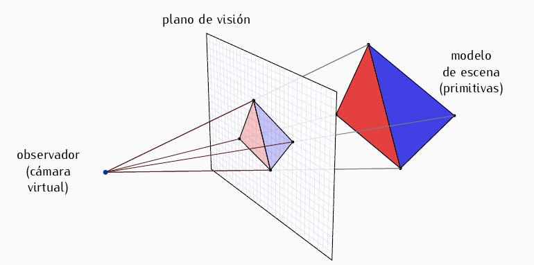

En el **shading** se usan atributos de la primitiva para asignar color a cada pixel que cubre. El sombreado puede ser simple (color plano) o avanzado (con sombras, iluminación)

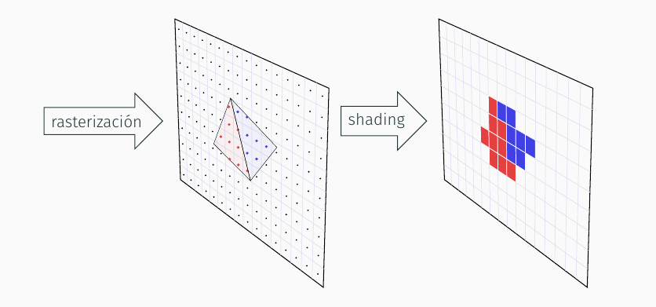

## Las APIs de rasterización

### Tipos de escritura

#### Directa

- La escritura en el framebuffer es lenta y se realiza pixel a pixel.
- No portable entre arquitecturas hardware o software.
- Una aplicación gráfica no puede coexistir con otras.

#### Apis gráficas
Se usan APIs gráficas portables y gestores de ventana

- Se consigue portabilidad y acceso simultaneo
- La escritura en el framebuffer sigue siendo lenta.

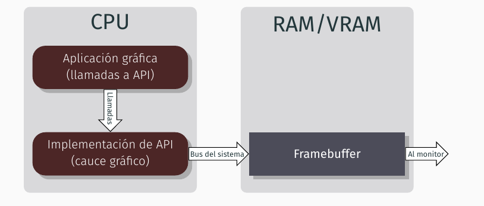

#### Apis y hardware gráfico
El uso de GPUs aumenta la eficiencia ya que se envía menos información de más alto nivel.

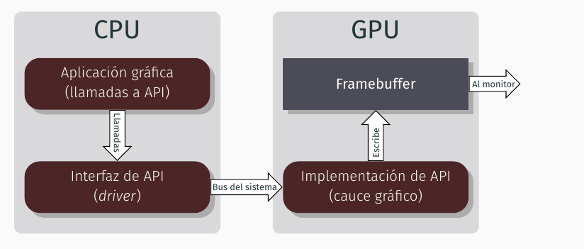

###APIs

**Antiguas:**
- OpenGL(1992)
- Directx(1995): para Windows y XBox
- OpenGL ES orientado a móviles
- WebGL para Javascript en navegadores

**Nuevas:**
- Metal(2014) de Apple
- DirectX 12 (2015)
- Vulkan (2016) sucesora de OpenGL

Estas nuevas APIs son de más bajo nivel que los anteriores pero a cambio se aprovecha mucho mejor el hardware.

## Etapas del cauce gráfico

1. Procesado de vértices
    - Transformación: se le hacen transformaciones a los vertices (en el plano o el espacio) hasta encontrar su punto en el plano de proyección. Es programable (puede ser modificado)
    - Teselación: transformaciones adicionales avanzadas que no vamos a estudiar

2. Post-procesado de vértices y montaje de primitivas: varios cálculos como el _recortado_ y el _cribado de caras_. No programable.
3. Rasterización. No programable.
4. Sombreado: se calcula el color que se asigna a cada pixel. No programable

# La librería OpenGL

## Bibliotecas complementarias

###GLU
- Funciones para configuración de la cámara virtual
- Dibujo de primitivas compejas
- Funciones de dibujo de alto nivel
- Las funciones de esta biblioteca comienzan por glu

###GLFW
- Libreria portable y open source
- Gestión de ventanas
- Gestión de eventos de entrada
- Las funciones de esta biblioteca empiezan con glfw

## Programación y eventos de GLFW

### Funciones gestoras de eventos
Cuando se produce un evento (ratón, teclado o cambio de tamaño de ventana) se invocan a las FGE también llamadas callbacks

- El programa establece qué eventos quiere gestionar y con qué función se hará
- Cuando se invoca a una de estas funciones, se dice que el evento ha sido procesado o gestionado
- Para cada evento, la función acepta unos parámetros determinados. Por ejemplo tecla que se ha pulsado/levantado, nueva posición del ratón, nuevo tamaño de la ventana.

### Estructura de un programa

- Variables, estructuras de datos y definiciones globales.
- Código de las funciones gestoras de eventos.
- Código de inicialización
  - Creación y configuración de la(s) ventana(s) donde se visualizan las primitivas.
  - Establecimiento de las funciones del programa que actuarán como gestoras de eventos.
  - Configuración inicial de OpenGL, si es necesario.
- Función de visualización de un frame o cuadro
- Bucle principal (gestiona eventos y visualiza frames)

GLFW mantiene una lista FIFO con información de cada evento que ha ocurrido pero no ha sido gestionado todavía por la aplicación. En cada iteración del bucle principal se espera hasta que ocurra un evento, entonces se extrae el siguiente evento de la cola y se ejecuta su función asociada. Si dicha ejecución ha cambiado algún modelo de escena o parámetro, se visualiza un cuadro nuevo. El bucle termina cuando en una función gestora se ordena cerrarla.

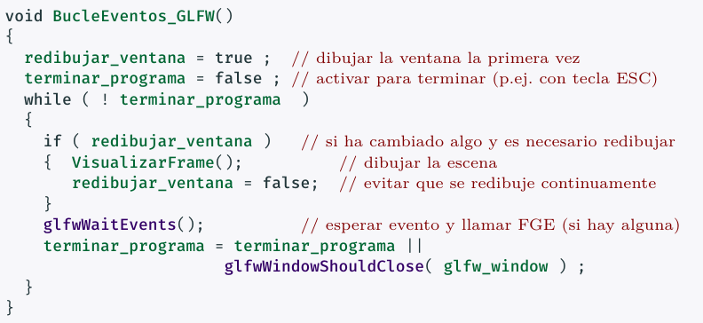

`redibujar_ventana` y `terminar_programa` son variables lógicas globales. Las FGE ponen estas variables a `true` según quieran refrescar la ventana o acabar la aplicación, respectivamente.

### Código de inicialización de GLFW
Se ejecuta al inicio de la aplicación, antes de cualquier orden de OpenGL. Aquí se deben especificar también los nombres de las funciones FGE.

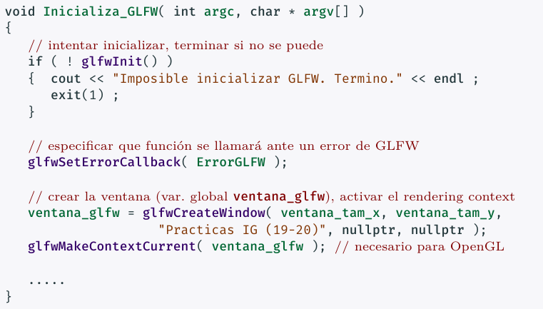

## Tipos de primitivas
Las primitivas se definen mediante secuencias de vértices. Pueden ser puntos, segmentos y polígonos. Con n vértices puedo definir:

- n puntos aislados
- n/2 segmentos independientes
- n-1 segmentos formando una polilínea abierta
- n segmentos formando una polilínea cerrada

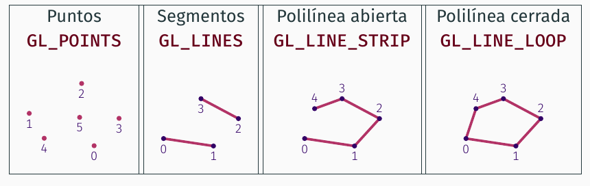

### Cribado de polígonos

Cada polígono es clasificado como delantero o trasero, según sus vértices se visualicen en sentido contrario a las agujas del reloj, o en el sentido de las agujas del reloj, respectivamente. Se puede configurar OpenGL para no mostras las primitivas delanteras (o traseras), esto es lo que se llama cribado, que por defecto está deshabilitado.

### Visualización de polígonos

Existen tres modos de visualización de polígonos en OpenGL:

- modo puntos
- modo líneas
- modo relleno

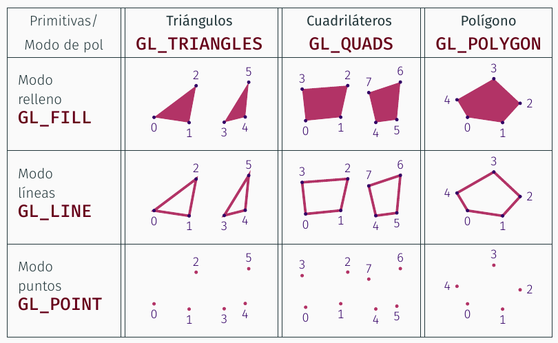

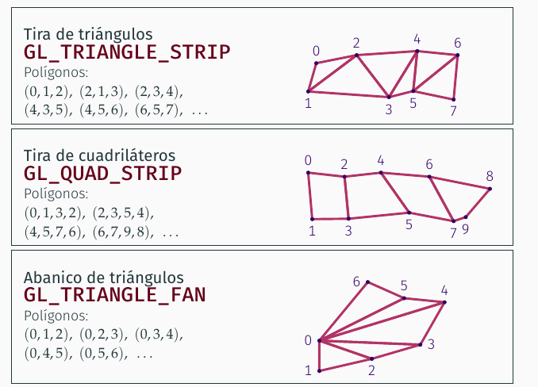


Respecto los polígonos de más de tres vértices, deben tener sus vértices en el mismo plano, no se deben intersecar sus aristas y deben ser convexos para que se visualicen correctamente. Aún así, a nivel interno todos los polígonos se convierten en triángulos (Teselación). En las últimas versiones de OpenGL se han eliminado las constantes de polígonos de más de 3 lados.


### Secuencias indexadas
En caso de polígonos que comparten vértices, tendríamos una lista de vértices donde muchos están repetidos, lo que ocupa espacio y memoria. En estos casos usamos vértices indexados. Mantenemos dos lista de vértices, la primera están los vértices y en la segunda está la secuencia real de vértices del polígono, pero referenciada con un entero hacia la lista de vértices.

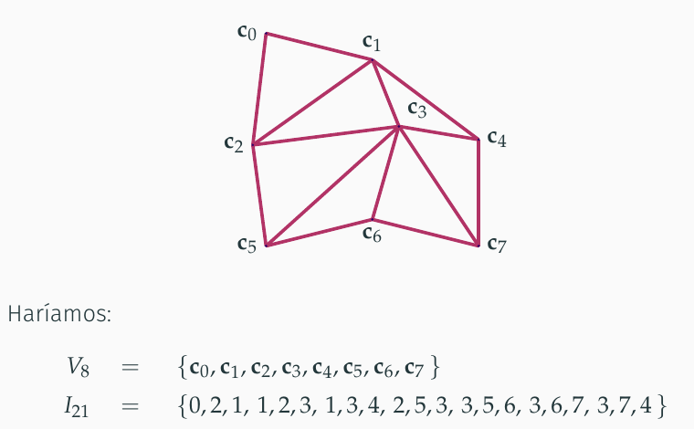

## Atributos de vértices
Se asignan en rasterización
- coordenadas: atributo imprescindible, sitúa al vértice en el espacio
- color: una terna RGB con valores entre 0 y 1. Puede ser RGBA y añadir un cuarto valor de transparencia. En el interior del polígono se usa interpolación para calcular el color.
- Normal: vector unitario con tres coordenadas reales, determina la orientación y se usa para la iluminación
- Coordenadas de textura: Para de valores reales que determinan que punto de la textura se fija al vértice.

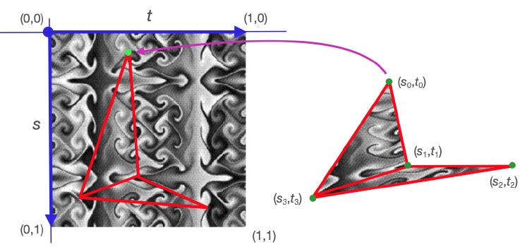

Cada vértice tendrá siempre una tupla por cada uno de estos atributos, aunque después algunos no se usen. Por ejemplo si no está activada la iluminación no se usarán las normales.

## Modos de envío

### Envío inmediato
- El programa envía a OpenGL la secuencia de coordenadas en orden. Aquí tenemos dos posibilidades:
  - Enviar vértice a vértice (1 llamada por vértice). No requiere tenerlos almacenados.
  - Enviar arrays completos con todos los atributos, almacenados en la RAM. Una única llamada.
- Se procesa la secuencia de vértices y se visualizan las primitivas en el framebuffer activo.
- OpenGL no almacena las coordenadas tras la visualización
- Para volver a visualizar una primitiva hay que volver a enviarla.
- Cada vértice es una tupla de 3 coordenadas en el espacio euclídeo 3D.


### Modo diferido
El envío inmediato es ineficiente porque requiere enviar todos los vértices en cada visualización aunque no cambien. En el modo diferido:

- La secuencia de vértices se envía una sola vez a la GPU. Esto requiere reservar memoria en la GPU y transferir los datos.
- Cada vez que se visualizan las primitivas, OpenGL las lee de la GPU, que es mucho más rápido que desde la RAM ya que no pasa por el bus del sistema.
- Las zonas donde la GPU almacena información de primitivas se llaman Vertex Buffer Objects.

## Almacenamiento de vértices y atributos
Usamos SOA, es decir una estructura con varios punteros.

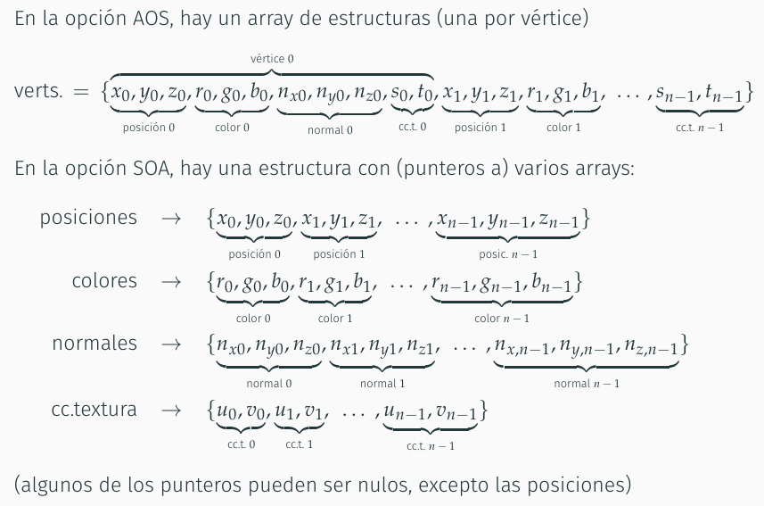

### VBO para modo diferido
El modo diferido requiere reservar memoria en la GPU, para lo que se usan VBO, que es un bloque de bytes contiguo en la memoria de la GPU.

- Se pueden crear VBOs en cualquier momento, indicando el tamaño en bytes del VBO.
- Se identifica cada VBO por un valor numérico, se dice que este es el nombre del VBO. Es de tipo GLuint (equivalente a unsigned int)
- Una dirección en memoria de la GPU viene dada por un nombre de VBO y un desplazamiento (offset)

### Descriptores de tabla

 Es la clase que controla una tabla de atributos/indices. Podemos usar estos atributos:

 1. tipo_tabla: para indicar si es una tabla de índices(GL_ELEMENT_ARRAY_BUFFER) o una tabla de coordenadas o atributos(GL_ARRAY_BUFFER)
 2. atributo: (para tablas de coordenadas). Indica qué tipo de tabla estamos usando. Puede valer:
    - GL_VERTEX_ARRAY: coordenadas
    - GL_COLOR_ARRAY: colores
    - GL_NORMAL_ARRAY: normales
    - GL_TEXTURE_COORD_ARRAY: coordenadas de textura
3. tipo_valores: codifica el tipo de dato. Se usa GL_UNSIGNED_INT para índices, y para valores de coordenadas o atributos usamos GL_FLOAT o GL_DOUBLE
4. num_bytes_valor: número de bytes por valor.
5. num_vals_tupla: valores reales por vértice. Debe ser 2,3 o 4 para atributos y 1 para índices
6. num_tuplas_ind: Para las tablas de atributos es el número de vértices, para las de índices es el número de índices.
7. tamano_en_bytes: tamaño de la tabla completa
8. datos: puntero a la dirección de memoria donde está el primer byte de la tabla.
9. nombre_vbo: 0 si la tabla sólo está en la memoria del programa, y un valor positivo si se ha hecho una copia en la memoria de la GPU.


### Vertex Array Objects (VAO)
Estructura de datos que continen toda la información sobre una secuencia de vértices.

- En modo automático se mantiene activo un único VAO, el cual hay que actualizar antes de poder visualizar otra secuencia de vértices.
- Para modo diferido, se pueden crear tantos VAOs como sea necesario
- Cada VAO tiene asociado un entero único, llamado nombre del VAO
- Hay un VAO por defecto que está creado y activo al inicio y cuyo nombre es 0. Es el único que se puede usar en modo inmediato.


### La clase ArrayVertices
Encapsula la información sobre una secuencia de vértice, facilitando la visualización.


````

 
class ArrayVertices
{
public:
// constructor (se indican las coordenadas)

ArrayVertices( const GLenum tipo_valores, const GLint num_vals_tupla, const GLsizei p_num_vertices, const GLvoid * datos );
~ArrayVertices();


// Métodos para crear y añadir los descriptores de tablas

void fijarColores ( GLenum tipo_valores, GLint num_vals_tupla, const GLvoid *datos );
void fijarCoordText( GLenum tipo_valores, GLint num_vals_tupla, const GLvoid *datos );
void fijarNormales ( GLenum tipo_valores, const GLvoid *datos );
void fijarIndices ( GLenum tipo_valores, GLsizei p_num_indices, const GLvoid * datos );


private:
GLuint nombre_vao = 0;     // se crea al visualizar en M.D. la primera vez
unsigned num_vertices = 0, // núm. de vértices (>0)
         num_indices = 0;  // núm. de índices (0 si no hay índices)
// Descriptores de tablas de datos (son propiedad de este ’ArrayVertices’)
DescrTabla
* coordenadas = nullptr, // debe ser creado en el constructor
* colores = nullptr, // creado en ’fijarColores’
* normales = nullptr, // creado en ’fijarNormales’
* coords_textura = nullptr, // creado en ’fijarCoordText’
* indices = nullptr; // creado en ’fijarIndices’ ;

};
````
### Vistazo general
Primero tenemos que crear los descriptores de tabla de los atributos que vayamos a usar, creando e inicializando primero las tuplasnt necesarias (n es el numero y t el formato). Después usaremos los métodos de la clase ArrayVerts para "cargar" la clase con una secuencia de vértices y todos sus atributos. Despúes usaremos esa clase para visualizar la secuencia de vértices.

## Envío de vértices y atributos
### Modo inmediato

- glVertex : Una llamada por vértice
- glDrawArrays: una única llamada, secuencias no indexadas.
- glDrawElements: una única llamada, secuencias indexadas.
