# Practica 1

## Descenso de gradiente

### 1.Implementación

Implemento el algoritmo del gradiente descendente en la función `gradient_descent` que aparece al principio. A esta función le paso como argumentos el punto inicial, que voy modificando hasta encontrar las coordenadas adecuadas; el learning rate; el número másximo de iteraciones que puede dar el algoritmo; la función, con la que se va a medir el error de las coordenadas; la función del gradiente de la función anterior; y el error que queremos conseguir.

Dentro del algoritmo inicializo una variable para las iteraciones a 0, y dentro del bucle while incremento en uno esta variable por cada iteración, mientras que actualizo el valor de mi w (`pto`) en función del gradiente. El bucle acaba cuando llego al número máximo de iteraciones o consigo un error menor o igual al buscado.

### 2.Función E(u,v)

La expresión analítica de la derivada es la siguiente:

$\frac{\partial E}{\partial u} = 2 \cdot (u^3 \cdot e^{v-2} - 2 v^2 \cdot e^{-u}) \cdot (3u^2 \cdot e^{v-2}+2e^{-u} \cdot v^2)$

$\frac{\partial E}{\partial v} = 2 \cdot (u^3 \cdot e^{v-2} - 4e^{-u} \cdot v) \cdot (u^3 \cdot e^{v-2}+2e^{-u} \cdot v^2)$

- Iteraciones necesarias para obtener un valor de la función inferior al error establecido: 10
- Coordenadas alcanzadas en dicha iteración: ( 1.1572888496465497 , 0.9108383657484799 )

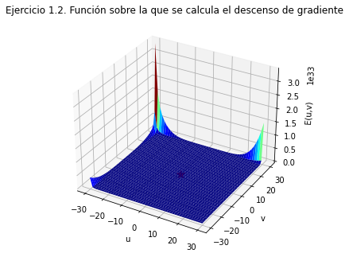

### 3\. Función f(x,y)

Para la comparación de w en función del learning rate he implementado una modificación del algoritmo de gradiente descendente llamada `gradient_descent_2`, para almacenar los valores de w a lo largo de las iteraciones y poder representarlos gráficamente. He usado un valor de error muy bajo (-10000) para asegurarme de que la función no lo iba a alcanzar, y así poder ejecutar las 50 iteraciones completas.

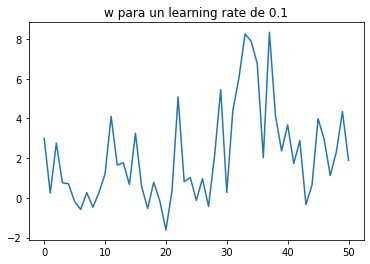

Vemos que para un learning rate de 0.1 el valor de la función para las coordenadas de w no converge. Esto es porque nuestro learning rate en este caso es demasiado grande para la función que tenemos y por tanto el valor de la función va dando saltos. Esto nos lleva obviamente a unas coordenadas w erróneas.

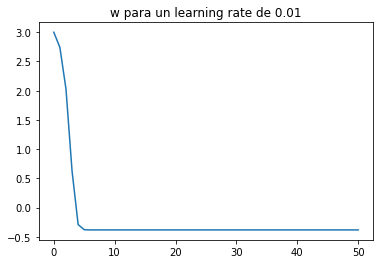

Para un learning rate de 0.01 vemos que el valor de la función desciende rápidamente, y claramente converge. Esto nos indica que se trata de un valor adecuado para el learning rate.

Coordenadas   | Valor mínimo       | Coordenada donde se alcanza
------------- | ------------------ | -------------------------------------------
(-0.5 , -0.5) | 9.125146662901855  | ( -0.79349947050906 , -0.125965758698950)
(1 , 1)       | 6.4375695988659185 | ( 0.6774387808772109 , 1.290469126542778)
(2.1 , -2.1)  | 12.49097144268     | ( 0.1488058285588777 , -0.096067704992243)
(-3 , 3)      | -0.3812494974380   | ( -2.7309356482481055 , 2.7132791261667037)
(-2 , 2)      | -4.7992313047e-31  | ( -2.0 , 2.0 )

Como hemos visto que para un learning rate de 0.01 el valor de la función no diverge, tenemos que el valor mínimo (local) que obtendremos se corresponde con el valor final al que converge tras las 50 iteraciones. Como nuestra función tiene varios mínimos locales, vemos que variando el punto inicial, la función se puede quedar atascada en estos mínimos locales, y no consigue salir de ahí. Por lo tanto depende del punto inicial que escojamos que podamos o no llegar al mínimo global

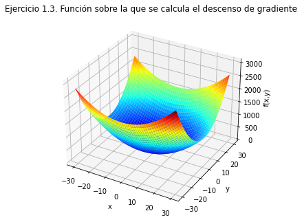

### 4\. Dificultad del mínimo global

Como ya hemos visto en los apartados anteriores, dada una función arbitraria, encontrar o no un mínimo global depende tanto del learning rate como del punto inicial escogido. Si escogemos un learning rate demasiado grande, nuestra función no convergerá a ningún valor, por lo que será imposible encontrar un mínimo (ni siquiera local). Si escogemos un punto inicial que se encuentre dentro de un mínimo local, entonces nuestra función no podrá salir de ahí, y obtendremos ese mínimo local como valor final, aún habiendo un mínimo global menor.

## Regresión lineal

### 1\. Modelo de regresión lineal

Para el algoritmo de descenso de gradiente estocástico, he usado una versión modificada del de descenso de gradiente. Antes de modificar w, calculo un minibatch de los datos de entrenamiento, por lo que cada iteración (cada modificación de w) se hace con un batch distinto. La función `batch()` es la encargada de hacer los minibatches, y ya que los escogidos no se vuelven a meter, nos aseguramos de que no se repitan elementos entre los distintos minibatches. El tamaño de cada batch lo he escogido en función del número de iteraciones, al ser 200 iteraciones (se dijo que este número era razonablemente bueno), escojo un tamaño de `nº elem/nº iter`, de manera que los batches sean completamente disjuntos entre sí. La función `Err()` es el error cuadrático medio.

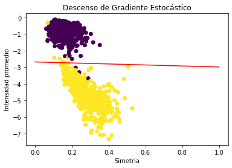

Para el método de la pseudoinversa simplemente usamos la fórmula de la pseudoinversa que aparece en las transparencias.

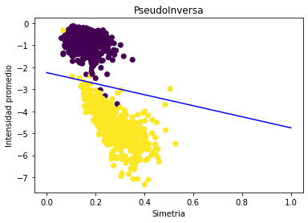

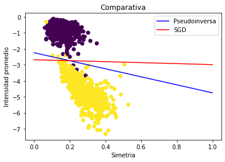

### 2\. Experimento

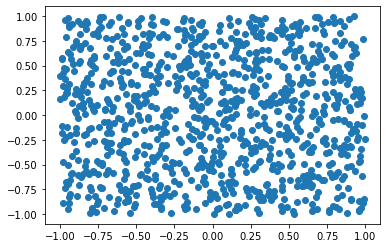

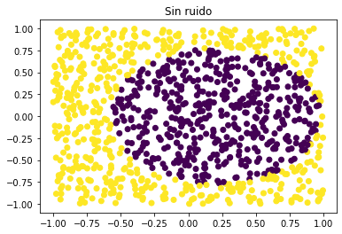

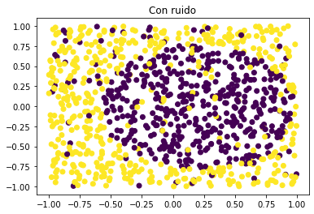

Cuando intentamos el ajuste con el modelo lineal , vemos que no es adecuado, ya que los valores de Ein y Eout son demasiado altos. Para el experimento he usado el descenso de gradiente estocástico para calcular la w, y los mismos valores para los parámetros que en el apartado anterior. Hacemos una comparativa, para el experimento N=1000, del vector de características lineal y no lineal

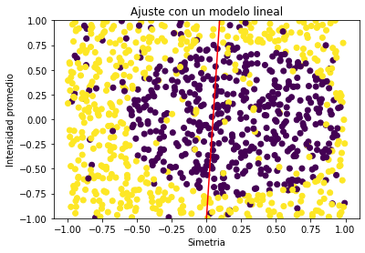

X         | Ein        | Eout
--------- | ---------- | ----------
Lineal    | 0.93221018 | 0.9696452
No Lineal | 0.773419   | 0.91892161

Vemos que para el vector de característicasno lineal hay una mejora considerable. Sin embargo, hay mucha más mejora con los datos de la muestra que con los datos del test, por lo que, aunque es cierto que el modelo mejora, en gran parte se trata de un sobreajuste con los datos de muestra, y no una mejoría real. Aún así, pienso que el modelo no lineal es más adecuado ya que, aunque trae un sobreajuste, sí representa una mejora objetiva con respecto al modelo lineal, ya que el error en el test es menor.
