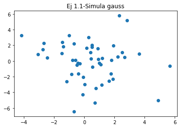
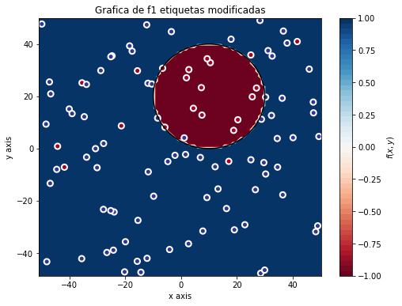
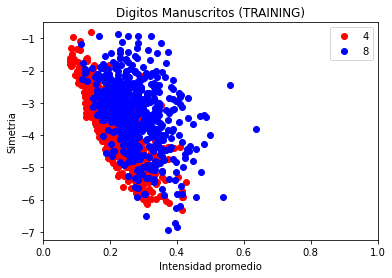
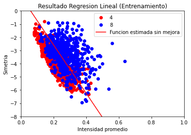

# Ejercicio 1

## Apartado 1
En este apartado simplemente generamos las nubes de puntos que nos piden, usando las funciones dadas para ello. Los argumentos vienen dados por lo que el ejercicio no tiene mayor complicación. Luego genero tanto la gráfica de la nube de puntos uniforme (Figura 1) como de la Gaussiana (Figura 2)

## Apartado 2

### Subapartado a

En primer lugar genero unos datos de muestra de acuerdo a como se pide al principio del enunciado (Figura 3).

Luego genero una recta aleatoria dentro del rango de valores del conjunto, y usando la funcion 'f' dada, asigno etiquitas a los datos de la muestra, clasificandolos según la recta escogida antes (Figura 4). Evidentemente, como se puede apreciar en la imagen, todos los puntos están bien clasificados respecto de la recta, ya que es la recta que hemos usado para clasificar.

## Subapartado b

Para añadir un porcentaje de ruido a las etiquetas he creado una función llamada `etiquetar_ruido(conjunto, porcentaje)`. La función devuelve los índices de las etiquetas con un valor positivo, los índices de las etiquetas con valor negativo, y un porcentaje de sendos índices que seran los que cambiemos su valor.

Como vemos ahora hay puntos que están mal clasificados con respecto a la recta (Figura 5), en concreto aquellos a los que hemos cambiado el valor de su etiqueta. En una muestra que contenga ruido, siempre vamos a tener elementos mal clasificados respecto de la función clasificadora.

## Subapartado c

Dibujamos las gráficas sobre los datos anteriores y las etiquetas obtenidas en el apartado anterior. Como vemos, estas funciones se ajustan peor a la hora de clasificar los puntos que la recta que teníamos antes. Esto se debe principalmente a que no hemos hecho un proceso de aprendizaje y hemos cogido las funciones de manera arbitraria. Una conclusión que podemos sacar es que una función más compleja no tiene por que ajustarse mejor a los datos, y de hecho en nuestro caso la función lineal es la que más se ha ajustado a los datos que tenemos. También cabe mencionar, que aunque hubieramos hecho un proceso de aprendizaje, seguiriamos teniendo errores de clasificación aún con las funciones complejas, debido al ruido en la muestra. Reafirmamos la idea del apartado anterior de que en una muestra con ruido siempre tendremos elementos mal clasificados.

Esta última idea se reafirma cuando reetiquetamos nuestros datos de muestra para asignar etiquetas en base a la función que dibujamos luego. Vemos que el error disminuye en cada uno de los cuatro casos  con respecto a la situación anterior , pero seguimos teniendo un 10% de error en los datos etiquetados en todos los casos, a pesar de usar funciones complejas.

# Ejercicio 2

## Apartado 1. Algoritmo Perceptrón

En este apartado usamos el conjunto de datos que teniamos anteriormente, con la recta que habiamos generado y las etiquetas correspondientes a esa recta como función clasificadora.

### Subapartado 1.

En este apartado ejecutamos el algoritmo de aprendizaje PLA en los datos sin ruido (Figura 6). Vemos que el algoritmo clasifica perfectamente los datos, con un Ein=0, tanto para el vector inicial de 0's como para el de vectores de nº aleatorios entre 0 y 1. La diferencia es, sin embargo, que el número de iteraciones medio para converger en el segundo caso (150.6) es practicamente el doble del número de iteraciones necesario para converger en el primero (75). Esto se debe, como hemos visto en teoría, a que el algoritmo PLA es muy sensible a la elección del punto inicial.

### Subapartado 2.
En este apartado hacemos lo mismo pero con ruido en las etiquetas (Figura 7). Como podemos ver, la solución no clasifica correctamente el conjunto de muestra, y tiene unos datos de error bastante elevados, en concreto, alrededor de 10500 con vector inicial de ceros y de 12000 en el otro caso. También podemos ver que el algoritmo no converge, ya que usará las máximas iteraciones que pueda. En el código he usado un máximo de iteraciones de 2000 para que no tarde mucho en ejecutarse, pero he probado varios valores hasta 100000 iteraciones, y siempre las usa todas y en ningún caso converge.

Esto se debe a que cuando introducimos ruido en la muestra nuestro conjunto de datos ya no es linealmente separable, y como hemos visto en teoría, para este conjunto de datos el algoritmo no converge. Esa es la principal diferencia respecto al apartado anterior, donde al ser un conjunto linealmente separable, tenemos la convergencia del algoritmo asegurada.

## Apartado 2. Regresión logística
En este ejercicio he realizado el experimento con los datos que se pedían, ofreciendo un resultado bastante aceptable y en un tiempo razonable. El modelo clasifica bastante bien los datos de entrenamiento, pero falla más con los de test debido a que es mucha mayor la cantidad de datos. En términos relativos está muy parejo. 

# Ejercicio 3. Bonus

En este ejercicio, el resultado de w ha sido el mismo antes y después de la mejora, es decir que el algoritmo PLA Pocket no ha mejorado el modelo. Esto se debe principalmente a que el algoritmo PLA no converge para datos no linealmente separables, que es el caso en que nos encontramos. Al usar PLA Pocket y no PLA normal nos hemos asegurado de que nuestra solución al menos no empeora, conservando el mismo resultado que habíamos obtenido en regresión lineal. Probando con valores de w obtenidos del PLA estándar la solución empeora mucho con respecto a la obtenida en SGD, por lo que en ningún caso supondría una mejora.

## Apartado 1

Tenemos un problema de clasificación logística, donde tenemos que clasificar números manuscritos en las clases 4 y 8 a partir de su intensidad promedio y simetría. Tenemos un conjunto de datos de N elementos, (xi,yi), el cual vamos a dividir en conjuntos de entrenamiento y test. En nuestro caso las características xi son intensidad promedio y simetría, e yi es la etiqueta, que será 4 u 8. En este caso los datos son no linealmente separables. La función objetivo es aquella que asigna a cada número su etiqueta, va desde el par (intensidad, simetria) hasta el conjunto {4,8}

## Apartado 2

### Subapartado 1

Por lo explicado anteriormente, las graficas para SGD (Figuras 11-12) son las mismas que para PLA Pocket (Figuras 13-14). Los parámetros fijados en SGD son los que mejor resultado me dieron después de varias pruebas. Con mayor learning rate la diferencia era apenas notable, llegando a empeorar en algunos casos, y con el doble de iteraciones el resultado mejoraba solo en centésimas, por lo que he decidido dejar los parámetros así.

### Subapartado 2

También por lo explicado anteriormente, como el w es el mismo antes y después de pasar por el algoritmo PLA Pocket, los errores Ein y Etest son los mismos.

### Subapartado 3

Primero acoto en función de `Ein`, por tanto uso la expresión que aparece arriba en la penúltima página de las diapositivas de la práctica, ya que en este caso la cardinalidad de H es infinita. Sabiendo que la dimensión Vapnik Chervonenkis del perceptrón es 3, simplemente calculo con el delta dado. Obtengo como resultado: 1.074

Para acotar `Eout` en función de `Etest`, uso la otra expresión, sabiendo que la cardinalidad de H en este caso es 1. Obtengo como resultado: 0.778

En este caso la cota que obtengo a partir de `Etest` es mejor ya que al ser más pequeña me permite hacerme una mejor idea del valor real de `Eout`, y aunque no pueda conocerlo realmente es una mejor aproximación.
