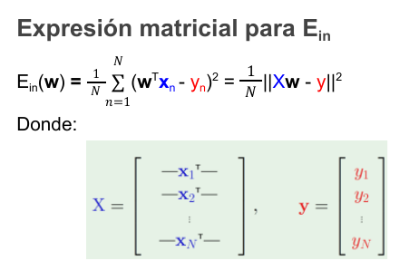
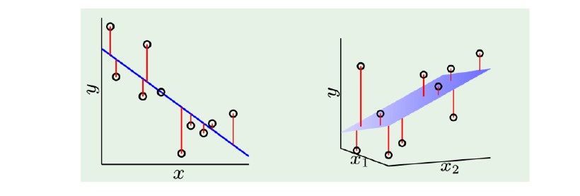
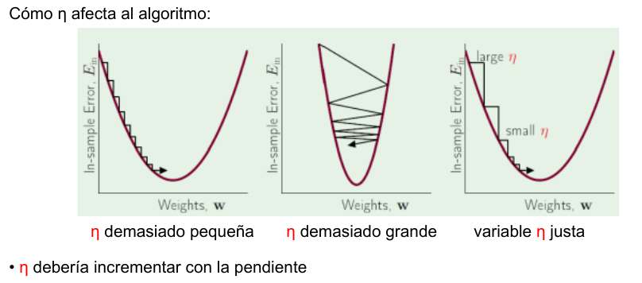
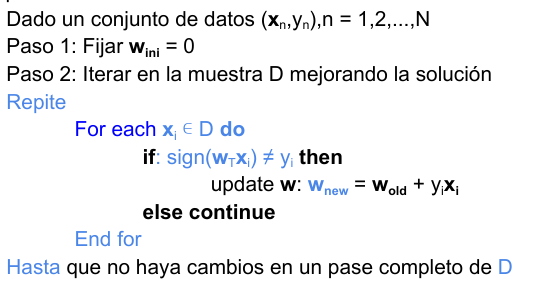
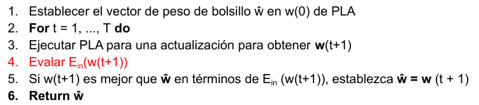
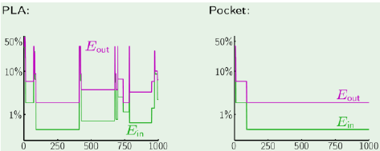
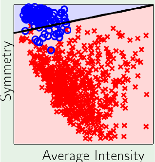
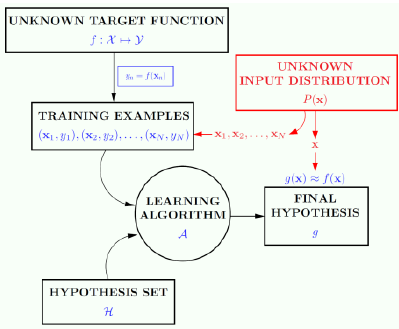
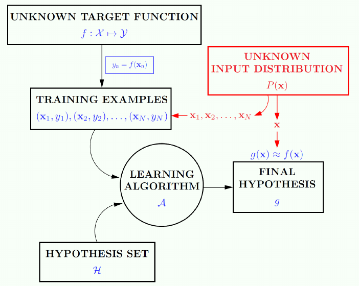

# Tema 2: Modelos Lineales

## Configuración general
- $\mathcal{H}$ es la clase de todas las funciones lineales de los predictores/características (Hiperplanos)
- Para $h \in \mathcal{H}$ tenemos $h(x) = w_{0} + w_{1}x_{1} + \cdots + w_{d}x_{d} = w_{0} + \sum_{i=1}^{d} w_{i}x_{i}$
- Usando $x^{T} = (1, x_{1}, x_{2}, ..., x_{d} ), w^{T} = (w_{0}, w_{1}, ..., w_{d})$podemos escribir $h(x) = w^{T}x$
- Usando modelos lineales podemos abordar problemas de aprendizaje supervisado:
  - Regresión
  - Clasificación
  - Clasificación probabilística

- Al afrontar un problema de aprendizaje es muy recomendable (casi una regla no escrita) **probar primero un modelo lineal**

## Regresión

### Ejemplo del problema del crédito
En el caso continuo (regresión), debemos establecer una línea de crédito máxima para el cliente.$x_{i}$=(edad, salario anual, deuda actual, años en el trabajo actual...). Para un correcto tratamiento de los datos, debemos manejar cantidades similares, en concreto si la edad es un número entre 0 y 100, deberíamos expresar el salario y la deuda en miles de euros, en lugar de en euros, para tener unos datos más compactos. Aún así, si no hacemos esto el problema no estará mal, aunque simplifica el tratamiento de los datos.

- **Dataset** o conjunto de datos:$(x_{1}, y_{1}), (x_{2}, y_{2}), \cdots, (x_{N}, y_{N})$
- $y_{n}$es la línea de crédito para el cliente $x_{n}$. Cada $x_{n}$ es una característica. (Revisar esto)
- $h_{w}(x) = w_{0} + w_{1}x_{1} + \cdots + w_{d}x_{d} = w^{T}x$ Es la salida de la regresión lineal
- Para cada **w** dado tendremos diferentes valores de la salida, por lo que w es lo que nos marcará cuanto de buena es nuestra regresión.
- Para esa medición de cuanto de buena es la salida que obtenemos, usamos el error cuadrático medio, de nuestra $h_{w}$ con respecto de Y (etiquetas de los datos). El error de nuestra muestra será $E_{in}(h_{w}) = \frac{1}{N} \sum{n=1}^{N}(h_{w}(x_{n})-y_{n})^{2}$. Esta es la función que vamos a optimizar, es decir, buscamos un w de manera que minimice la anterior función para tener el mínimo error de predicción posible en los datos de la muestra.

### Regresión lineal
- $X = {1} \times \mathbb{R}^{d}$ , esto es porque $w_{0}$ (bias) no tiene ninguna característica asociada, es decir, no multiplica a ningún $x_{i}$  $Y=\mathbb{R}$ y $h:X\rightarrow Y$
- $E_{out}(h)= E_{(x,y)} [(h(x)-y)^2]$ con (x,y) no perteneciente a los datos de entrenamiento
- Queremos encontrar una $h$ de nuestro modelo lineal $H$ que **minimice $E_{out}$ **
- A nivel práctico expresamos $h \in \mathcal{H}$ como $h(x)=w^Tx$
- Para encontrar esa $h$ **minimizamos el riesgo empírico (ERM)**. Calculamos el error cuadrático medio para cada vector **w** y nos quedamos con el que minimice ese error.
$$E_{in}(w) = \frac{1}{N} \sum{n=1}^{N}(w^T x_{i} - y_{i})^2 $$
$$w_{mejor} = min_{\mathbb{R}^{d}} E_{in}(w)$$
- **Nota**: por qué el minimo ein garantiza un mínimo en eout. En principio creo que es porque a menor error en los datos (que es la única información que tenemos), menor error en general para los casos posteriores que encontremos, es decir, si tenemos mayor error en los datos cabe esperar un mayor error fuera de ellos.

### Error cuadrático óptimo
- Medir el error minimizando el error cuadrático es el **modelo de Mínimos Cuadrados Ordinarios-MCO** (Ordinary Least Square Model - OLS). Este sólo asume un error en la variable dependiente, pero no tiene en cuenta el ruido que hay. Es una buena aproximación en muchos casos, pero no es válida en todos.
- Modelo: $y_{i}= f(x_{i}, w) + ruido$
- **Teorema de Gauss-Markov**: bajo el supuesto de ruido incorrecto de media cero y varianza acotada, la técnica OLS alcanza la mínima varianza no sesgada estimada para el conjunto de muestra. Matemáticamente, con:
$$y_{i} = x_{i}^T w + \epsilon _{i}$$
$$E(\epsilon_{i})=0, E(\epsilon_{i}, \epsilon_{j})=0, Var(\epsilon_{i}^2)=\sigma \textless \infty$$
OLS da un estimador de varianza mínima tal que: $E(w_{i}) = w_{i}$

### Expresión matricial de $E_{in}$

### Visualización de Regresión Lineal

Calculamos la recta (1) o plano (2) que menor $E_{in}$ tiene para en base a los $x_{i}$ poder predecir el valor $y_{i}$

### Propiedades de la regresión lineal????

### Algoritmos
Los algoritmos de aprendizaje nos sirven para calcular w

#### Pseudo-Inversa
Calculamos w en base a una fórmula matemática, esto se hace en un único paso y la velocidad depende del tamaño de la matriz.
1. Construimos la matriz X de características, que tendrá la característica $x_{i}$ en la fila i, y el vector columna Y.
2. Calculamos la **pseudo-inversa** $X^{t}=(X^{T}X)^{-1}X^{T}$
3. Devuelve $w = X^{t}Y$

#### Descenso de Gradiente
Es un algoritmo donde queremos ir **minimizando w** poco a poco hasta alcanzar un óptimo local siguiendo la dirección del vector del gradiente en cada punto. La intención es encontrar V tal que $E_{in}(w+\eta V) \textless E_{in}(w)$. V se corresponde con el gradiente de la función a optimizar, pero lo cogemos en negativo, para encontrar el mínimo (local). $\eta$ es el learning rate, que condicionará la velocidad con la que nos acercamos al mínimo local de la función.

**Ecuación general**: $w_{i+1}:= w_{i}-\eta Grad(w_{i})$ Esta actualización de w se hace para todos los valores del vector.

Cuando usamos todo el conjunto de muestra para calcular el gradiente hablamos de **Descenso de Gradiente por Lotes** (Batch Gradient Descent), y cuando usamos una parte de la muestra hablamos de **Descenso de Gradiente Estocástico** (Stochastic Gradient Descent). El trozo de la muesta que cogemos lo llamamos mini-batch. Algo habitual es realizar cada iteración con un minibatch distinto, de manera que todos los datos están representados pero el tiempo de ejecución del algoritmo disminuye notablemente. Lo ideal sería que estos minibatches sean disjuntos, y su unión sea el conjunto de la muestra.

#### Método de Newton
El método de Newton se basa en usar, además del gradiente, el **Hessiano** (derivadas de segundo orden) de la función a optimizar.

**Ecuación general**: $w_{i+1}:=w_{i}-\eta(H^{-1}(w_{i})Grad(w)_{i})$. Donde H es el Hessiano.

### En la práctica
- Analizando los datos:
  - La regresión 1D permite el análisis de residuos para detectar muestras fuera de la hipótesis OLS
- Analizando los residuales con gráficos (pequeñas muestras):
  - Errores correlacionados
  - Errores con varianza no constantes
  - Dependencia entre predictores
  - Valores atípicos: (relevante en pequeñas muestras)
- En dimensiones superiores o muestras de datos muy grandes, el escenario es más complejo y la hipótesis original pierde relevancia.
- Predictores categóricos
- Valores perdidos

### Características categóricas y valores perdidos
- Codificación de características categóricas (etiquetas):
  - En los modelos lineales se clasifican como un vector _one-hot_: [0,0,0,...,1,....,0,0], cuya longitud es el número de valores categóricos
  - Algunos modelos no lineales pueden gestionarlos. Ej: Árboles
- Valores perdidos:
  - Los modelos no lineales no pueden gestionar los valores perdidos
  - Valores sustitutos:
    - Se puede interpolar un valor a partir de su histograma de características
    - Se puede predecir un valor usando un modelo específico
  - Algunos modelos no lineales pueden gestionar esta situación. Ej. Árboles

## Clasificación

En general los casos de clasificación se centran en encontrar una función que nos separe el conjunto de datos. Ej: Distinguir dos números (clasificación de imágenes), aprobación del crédito (aprobación de si/no).

### Representación de la entrada
Los datos deben ser tratados. Si tenemos un problema de clasificación de imágenes, podríamos considerar que cada píxel es una característica, pero sería ir por la fuerza bruta. En lugar de eso, podríamos tomar como características la simetría y la intensidad. En tal caso pasaríamos de tener 256 características (o el tamaño de nuestra imagen) a tener solo 3 (recordemos el bias $w_{0}$). Nuestro modelo lineal, como tendría los mismos elementos que características haya, también se vería reducido, lo que nos simplifica mucho el problema.

### Perceptrón
El Perceptrón es un separador lineal que divide en dos clases. Dado un umbral **u**, el perceptrón realiza una suma ponderada, multiplicando la característica $x_{i}$ por su peso $w_{i}$, y viendo si esa suma supera el umbral o no, se le asigna una salida u otra. Tomando $b=-u$, tenemos que la función $h(x)$ del perceptrón es

$$h(x) = sign((\sum{i=1}^{d}x_{i}w_{i})+b), h(x) \in {-1,1}$$

$$E_{in} = min_{w \in \mathcal{R}^{d+1}} \frac{1}{N} \sum{n=1}{N}[sign(w^{T}x_{n}) \neq y_{n}]$$
Pero esta función es discreta no derivable, por lo que usamos la función

 $$Error(w^{T}x_{n},y_{n}) = \left\{\begin{matrix} -y_{n}w^{T}x_{n} si sign(w^{T}x_{n}) \neq y_{n} \\ 0 si sign(w^{T}x_{n}) = y_{n} \end{matrix}\right.$$

Equivalentemente, $Error(w^{T}x_{n}, y_{n})= max(0,-y_{n}w^{T}x_{n})$

### Algoritmo de aprendizaje del Perceptrón (PLA)
- Se trata de Stochastic Gradient Descent pero con tamaño de lote=1 y learning rate=1.
- Para conjuntos de datos **linealmente separables** PLA siempre encuentra un vector $w$ tal que $h(x_{i})=y_{i}$ para todas las muestras

- Según la teoría de aprendizaje (ERM), $E_{out}(g) \leq E_{in} + O(\sqrt{d\frac{log(N)}{N}})$. Este error de generalización es comparable al de la regresión lineal $O(\frac{d}{N})$, por lo que para un N suficientemente grande tenemos que $E_{out}$ y $E_{in}$ están muy cerca el uno del otro (su diferencia tiende a 0).

### Clasificación lineal: $E_{in} \approx 0$ ?
Dos escenarios:
1. Datos linealmente separables:
  - $B = min{\| w \|: \forall i \in {1,...,m}, y_{i}w^{T}x_{i} \geq 1, w \in \mathcal{R}^{d}}$ y $R = max_{i}\|x_{i}\|.
  - PLA se detiene después de un máximo de $(RB)^2$ iteraciones, y cuando se detiene tenemos que $\forall i \in {1,...,m}, y_{i}w^{T}x_{i} \geq 0$
  - La tasa de convergencia depende de B, pero este valor puede ser exponencialmente grande en d
  - La separabilidad lineal es una propiedad de los datos **D**, no del objetivo **f**
  - Una D lineal separable se puede haber generado a partir de un objetivo lineal separable o (por casualidad) de un objetivo no separable.

2. Dos casos:
  - **No existe solución** lineal separable. Este problema lo abordamos a través de transformaciones no lineales, que se verán luego.
  - **Errores** en una solución lineal separable. En este caso nos enfrentamos a un problema NP-hard en caso general. Abordamos una aproximación con el **Algoritmo de Bolsillo**.

### Algoritmo de bolsillo
Es una modificación del PLA donde se guarda el mejor vector solución encontrado hasta el momento. Es claramente menos eficiente que el PLA, ya que hay que ir evaluando los nuevos vectores solución, pero se garantiza que se obtendrá una buena solución después de un gran número fijo de actualizaciones.

### Regresión lineal para clasificación
- En regresión lineal, $y = f(x) \in \mathcal{R}$
- Aunque en clasificación usamos valores binarios, no dejan de ser valores reales.
- Usando regresión podemos obtener **w** donde $w^{T}x_{n} \approx y_{n} = \pm 1$
- En este caso, es probable que $sign(w^{T}x_{n})$ coincida con $y_{n} =\pm 1$
- Hay que elegir buenos pesos iniciales

## Etiquetas con ruido: una configuración general

### Muestras con ruido
- Un escenario realista debe considerar etiquetas ruidosas, esto es $y_{n} \neq f(x_{n})$
- En general tenemos objetivos ruidosos por falta de información sobre las variables que definen la función desconocida. Es decir, la función objetivo no siempre es una función determinista.

### Distribución objetivo
- En lugar de $y = f(x)$ (determinista), ahora usamos probabilidades: $P(y|x)$
- Cada muestra (x,y) se genera a partir de la distribución conjunta: $P(x)P(x|y)$
- El **objetivo ruidoso** es un objetivo determinista ($f(x)=E(y|x)$) añadiendole ruido $r=y-f(x)$

### Conexión entre P(Y|X) y P(X)
- La **distribución objetivo** $P(y|x)$ es lo que queremos aprender
- La **distribución de entrada** $P(x)$ cuantifica la importancia relativa de x.
- El **aprendizaje termina una vex conozcamos $P(x,y)$**. $P(x,y)= P(x)P(y|x)=P(x|y)P(y)$
- Podemos computar $P(x|y)$ desde dos enfoques: calculandolo directamente (aproximación discriminativa), o a partir de $P(x|y)$ usando las reglas de Bayes (aproximación generativa)

## Estimación de probabilidad

### Regresión logística
- Regresión lineal: $h(x)=w^Tx$
- Regresión logística: $h(x)=\sigma(w^Tx) \in [0,1] ó [-1,1]$
- La función $\sigma$ se llama función logística: $\sigma(x)=\frac{1}{1+e^{-x}}= \frac{e^x}{e^x+1}$
- También podemos usar la función $tanh(x)$ pero es menos común.

Esto lo hacemos basicamente porque nos dan valores deterministas (las etiquetas), que debemos transformar en probabilidades.

### Notación (pasar a formulas)

$$\mathrm{h}(\mathbf{x})=\sigma\left(\mathbf{w}^{\top} \mathbf{x}\right)=\frac{e^{w^T x}}{1+e^{w^T x}}$$

$$1-h(\mathbf{x})=\sigma\left(-\mathbf{w}^{\top} \mathbf{x}\right)=\frac{1}{1+e^{w^T x}}$$

La razón $\frac{h(x)}{1-h(x)}$ es llamada **odds** (probabilidades), y tenemos que $\ln ( odds )=\ln \left(\frac{h(x)}{1-h(x)}\right)=\ln \left(\mathbf{e}^{w^{T} x}\right)=\mathbf{w}^{\top}\mathbf{x}$

### Criterio de aprendizaje: ML
Elegimos la hipótesis $h$ que maximiza $L(w)$, que es la probabilidad de la muestra.

$$\mathrm{L}(\mathbf{w})=\prod_{i=1}^{N} \mathrm{P}\left(\mathrm{y}_{i} \mid \mathbf{x}_{i}\right)=\prod_{i=1}^{N} \sigma\left(y_{i} \mathbf{w}^{\top} \mathbf{x}_{i}\right)=\prod_{j=1}^{N_{1}} \sigma\left(\mathbf{w}^{\top} \mathbf{x}_{j}\right) \prod_{k=1}^{N_{-1}} \sigma\left(-\mathbf{w}^{\top} \mathbf{x}_{k}\right)$$

De forma equivalente podemos minimizar $E_{in}$

$\mathrm{E}_{\mathrm{in}}(\mathbf{w})=-\frac{1}{N} \ln (\mathrm{L}(\mathbf{w}))=\frac{1}{N} \sum_{i=0}^{N} \ln \left(\frac{1}{P\left(y_{i} \mid x_{i}\right)}\right)=\frac{1}{N} \sum_{i=0}^{N}\left(\ln \left(1+\mathrm{e}^{-\mathrm{y_{i}} \mathrm{w^T} \mathrm{x_{i}}}\right)\right)$

### Clasificación multietiquetas
Podemos generalizar la regresión logística binaria para hacer frente a k etiquetas en lugar de 2.
