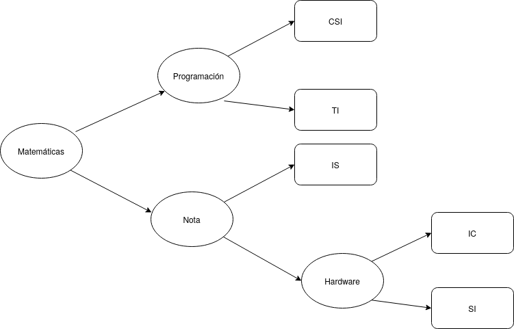

El programa pide los datos al usuario y los guarda. Cuando se pide la nota media, el programa la transcribe en Baja (1-6), Media (6.1-8.5) y Alta (8.6-10). Luego, dependiendo de las respuestas dadas se elige la rama adecuada. Según la rama y las opciones elegidas, se da una explicación para razonar la decisión, que luego se incluye a un deftamplate consejo junto con la rama y el Experto. Finalmente se imprime por pantalla el resultado final. La toma de decisiones para una rama es la siguiente:

